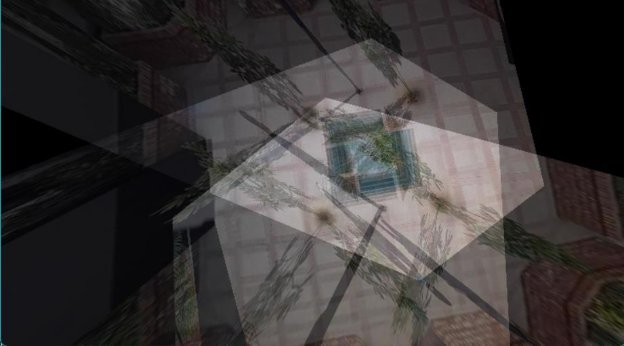
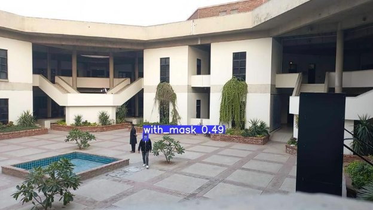
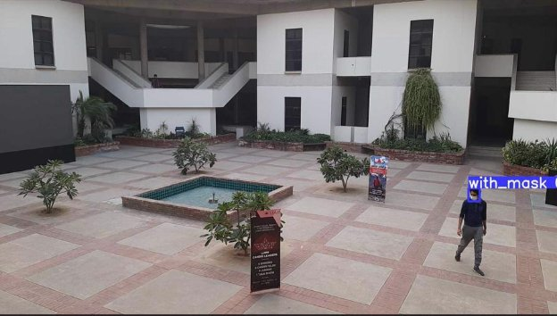
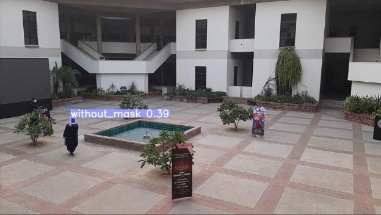
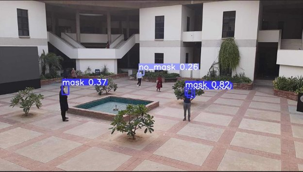
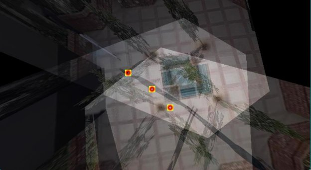

Autonomous COVID-19 Standard Operating Procedure Violation Flagging System 

**This repository contains the final project as part of the Computer Vision class at LUMS** 

The first task of the project was to create a top view using perspective transformation from three camera angles. The final projection is displayed below:  

The second task was to train an object detection model. For the purpose of identifying all individuals wearing and not wearing masks, we fine-tuned a YOLOv5 model on our dataset.  

Sample images from our model predictions are shown below: 

The center coordinates of the bounding box are then projected on the top view to create an animated violation hotspot heatmap. A frame from the heatmap is displayed below 

